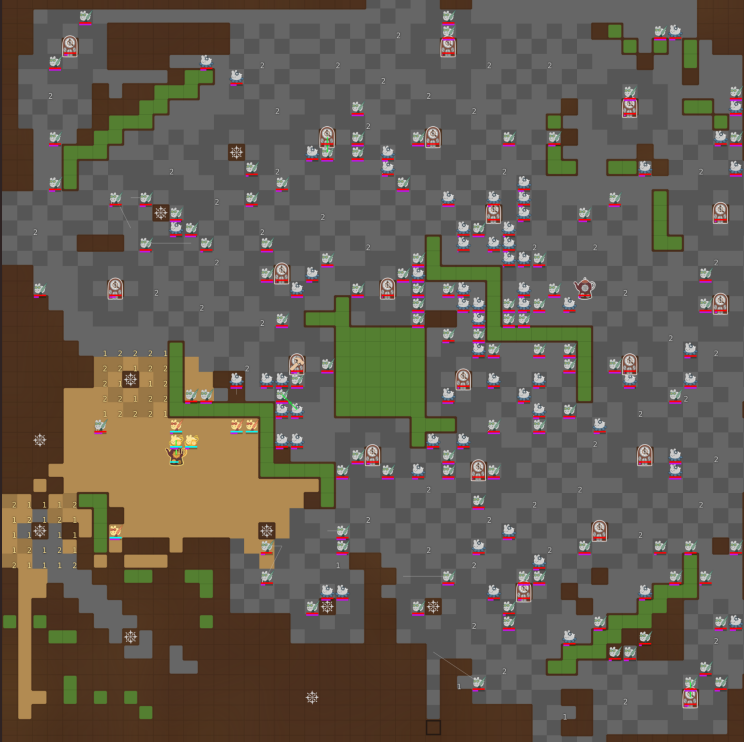

# Jambi X Bekasi - Battlecode 2026 Greedy Bots

## Overview

This project is a submission for **IF2211 Algorithm Strategy (Strategi Algoritma)** at Institut Teknologi Bandung. The task is to design competitive bots for **Battlecode 2025**, a real-time strategy game where teams of robots compete to control territory by painting it with their team's color.

The core challenge is to make locally optimal decisions at each robot's turn — a natural fit for **greedy algorithms**. Each bot in this repository represents a different greedy philosophy: balanced expansion, aggressive offense, or maximum area coverage. All three approaches emerge from the same algorithmic question: *given limited information and one action per turn, what is the best move right now?*

The game involves four robot types (Soldiers, Splashers, Moppers, and Towers), a paint economy that must be managed carefully, and a map that rewards both territorial control and combat pressure. Strategy shifts across three phases (early, mid, late) add an additional layer of decision-making that each bot handles differently.

---

This repository contains implementations of three Battlecode 2025 bots based on greedy algorithms:

- `main_bot` (primary bot, final submission)
- `alternative_bots_1` (offensive variant)
- `alternative_bots_2` (coverage-maximizing variant)

In addition to the bot source code, the repository also includes a complete LaTeX report (`docs/`).

## Strategy Summary

### 1. `main_bot` - Scoring-Based Nearest Target (Final)

**Core focus:**
- Tower-first expansion balanced with opportunistic combat.
- Soldiers with states: `EXPLORE`, `REFILL`, `COMBAT`, `BUILD_TOWER`, `BUILD_SRP`.
- Splashers for accelerated coverage (while avoiding risky splashes near enemy towers).
- Moppers as support stabilizers (mop swing, enemy paint cleanup, paint transfer).
- Phase-based tower spawning: Soldier-heavy early, balanced mid, Splasher-heavy late.

**Strengths:**
- Stable across all game phases (early, mid, late).
- Consistent expansion and sustain across a wide variety of maps.

---

### 2. `alternative_bots_1` - Greedy Offensive

**Core focus:**
- High offensive pressure: fast `RUSH`/`ATTACK` toward enemy targets.
- Splashers and Soldiers more aggressively pursue attack momentum.
- Build/refill actions are present but not the primary objective.

**Strengths:**
- Can apply significant pressure on maps and game states that favor aggression.

**Trade-offs:**
- More sensitive to early push failure and resource mismanagement.

---

### 3. `alternative_bots_2` - Coverage-Maximizing Greedy

**Core focus:**
- Coverage-first strategy to dominate area control (including tiebreak scenarios at game end).
- Soldier states: `REFILL`, `COMBAT`, `BUILD`, `SRP`, `COVER`.
- Sector partitioning and low-overlap exploration.
- Coverage-oriented phase-based spawning.

**Strengths:**
- Stable area control on open and semi-open maps.

---

## Project Structure

```text
.
├── src/
│   ├── main_bot/
│   ├── alternative_bots_1/
│   └── alternative_bots_2/
├── docs/
│   ├── main.tex
│   └── sections/
├── matches/
├── artifacts/
│   ├── engine/engine.jar
│   └── client/
├── build.gradle
├── gradle.properties
└── README.md
```

**Notes:**
- `artifacts/engine/engine.jar` and the client artifact are already provided in this repository.
- Headless match replay output is saved to the `matches/` folder.

## Prerequisites

- JDK 21 (required)
- OS: Windows / Linux / macOS
- (Optional) TeX Live + `latexmk` if you want to build the PDF report

## Quick Start

### 1. Build the project

```bash
./gradlew build
```

### 2. Run the App

To launch the app, run **"Stima Battle Client.exe"** from the client folder.

### 3. List available bots

```bash
./gradlew -q listPlayers
```

Expected output:
- `main_bot`
- `alternative_bots_1`
- `alternative_bots_2`

## Configuring `gradle.properties`

This file contains defaults for the run task:

| Property | Description |
|----------|-------------|
| `teamA` | Bot assigned to Team A |
| `teamB` | Bot assigned to Team B |
| `maps` | Map(s) to play on |
| `debug` | Enable debug mode |
| `outputVerbose` | Verbose console output |
| `showIndicators` | Show debug indicators in client |
| `validateMaps` | Validate maps before running |
| `alternateOrder` | Alternate team spawn order |

You can either edit the defaults directly in this file, or override any property at runtime using `-Pkey=value`.


## Team

| Name | NIM |
|------|-----|
| Kevin Wirya Valerian | 13524019 |
| Muhammad Aufar Rizqi Kusuma | 13524061 |
| Athilla Zaidan Zidna Fann | 13524068 |
